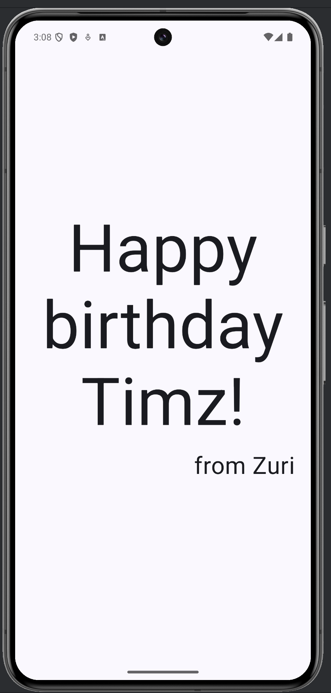

# TheAndroidSeries

A simple Android application built using Jetpack Compose that displays a personalized birthday greeting. This project serves as a practice exercise for learning the fundamentals of modern Android development.

## Description

TheAndroidSeries is a "Happy Birthday" app that demonstrates:
- Basic UI layout using `Column` and `Row` (though primarily `Column` in the current version).
- Using `Text` composables with custom styling (font size, line height, alignment).
- Implementing Compose themes and surfaces.
- Using `@Preview` for UI development.

## Screenshots



## Tech Stack

- **Kotlin**: The primary programming language.
- **Jetpack Compose**: Android's modern toolkit for building native UI.
- **Material 3**: The latest version of Google's open-source design system.
- **Gradle**: Build automation system.

## Getting Started

### Prerequisites

- Android Studio Koala or newer.
- JDK 17 or higher.

### Installation

1. Clone the repository:
   ```bash
   git clone https://github.com/timzowen/TheAndroidSeries.git
   ```
2. Open the project in Android Studio.
3. Wait for Gradle sync to complete.
4. Run the app on an emulator or physical device.

## Project Structure

- `app/src/main/java/com/timzowen/theandroidseries/MainActivity.kt`: Contains the main entry point and the `GreetingText` composable.
- `app/src/main/java/com/timzowen/theandroidseries/ui/theme/`: Contains the theme, color, and typography definitions.
- `app/src/main/res/`: Contains application resources like strings and drawables.

## License

This project is open-source and available under the [MIT License](LICENSE).
