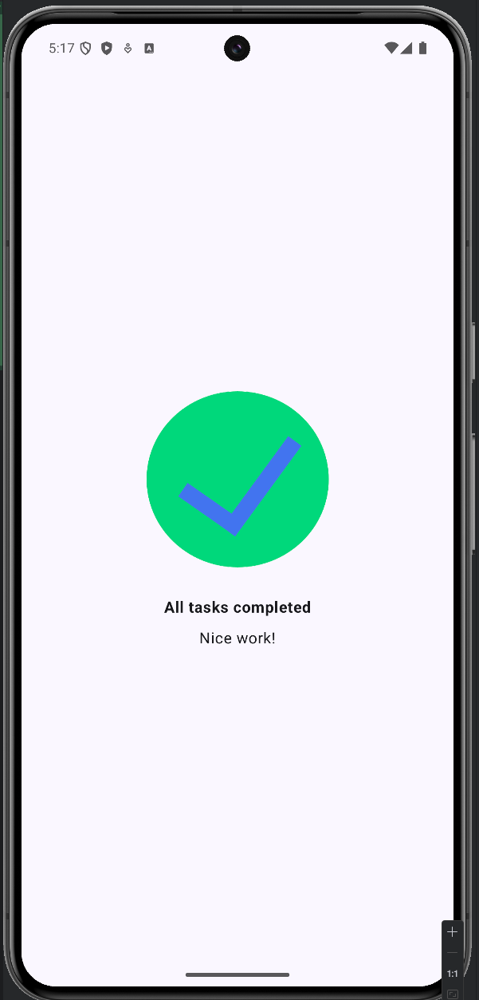

# Task Manager App

A simple Android application built with Jetpack Compose that displays a "Task Completed" screen.

## Features
- Clean and minimal UI.
- Displays a completion image and success messages.
- Built using modern Android development practices (Jetpack Compose, Scaffold, Edge-to-Edge).

## Screenshot

## Technologies Used
- **Kotlin**: The primary programming language.
- **Jetpack Compose**: For building the UI declaratively.
- **Material 3**: For modern UI components and styling.

## How to Run
1. Clone the repository.
2. Open the project in Android Studio.
3. Build and run the app on an emulator or a physical device.
