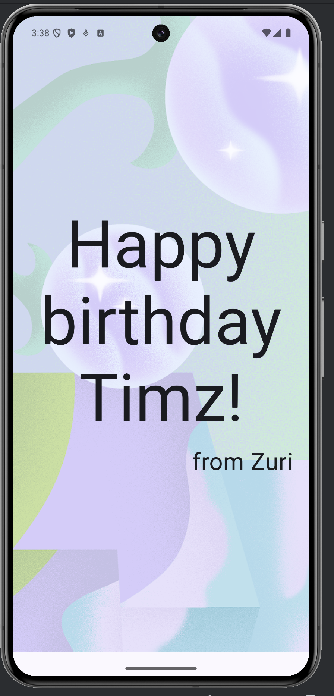

# The Android Series: Happy Birthday App

A simple Android application built with Jetpack Compose as part of **The Android Series**. This app displays a personalized birthday greeting with a background image.

## Features
- **Jetpack Compose**: Built using modern Android UI toolkit.
- **Customizable Greeting**: Displays a "Happy birthday Timz!" message from "Zuri".
- **Responsive Layout**: Uses `Box` and `Column` for layering text over an image.

## Preview

  

## Project Structure
- `MainActivity.kt`: Contains the main entry point and Compose UI components (`GreetingText`, `GreetingImage`).
- `strings.xml`: Stores the string resources for the app.
- `androidparty.png`: Background image resource used in the app.

## Getting Started
1. Clone the repository.
2. Open the project in Android Studio.
3. Build and run the app on an emulator or physical device.

---
*Created as part of the Android learning journey.*
